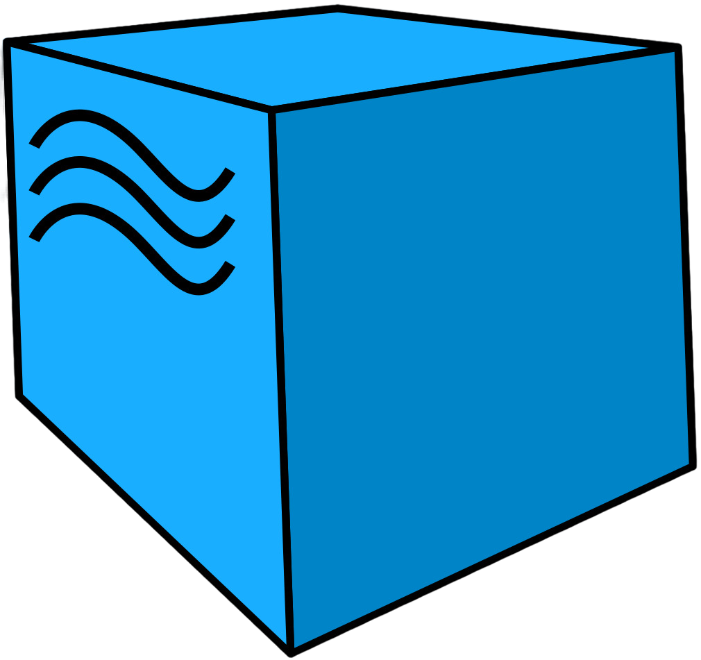

  

---
### Дополнительное образование и пройденные курсы

<table width="100%" border='0'>
    <tr><td width="15%" valign="bottom"></td><td valign="middle">QA GURU Автоматизация тестирования на Python <a target="_blank" href="https://stepik.org/">Сертификат</a></td></tr>
    <tr><td width="15%" valign="bottom"></td><td valign="middle">Stepik Автоматизация тестирования с помощью Selenium и Python <a target="_blank" href="https://stepik.org/">Сертификат</a></td></tr>
    <tr><td width="15%" valign="bottom"></td><td valign="middle">Stepik Программирование на Python <a target="_blank" href="https://stepik.org/">Сертификат</a></td></tr>
    <tr><td width="15%" valign="bottom"></td><td valign="middle">Stepik Тестирование ПО с нуля. Теория + Практика. Уровень BASIC <a target="_blank" href="https://stepik.org/cert/2723793">Сертификат</a></td></tr>
    <tr><td width="15%" valign="bottom"></td><td valign="middle">Stepik Web-технологии <a target="_blank" href="https://stepik.org/cert/1937401">Сертификат</a></td></tr>
</table>

---

### 🛠️ Навыки и используемые  инструменты

    
    
    
    
    
    
    
    
    
    
    
    
    
     
    
    
    
    
    
    
    
    

### 📊 Статистика профиля Github

 
 
 

---

### 🚀 Примеры моих проектов по автоматизации тестирования на Python

#### <a target="_blank" href="https://github.com/falinpavel/qa_guru_graduation_project_ui">Фреймворк для автоматизации тестирования UI на примере веб-приложения "CM Store"</a>
#### <a target="_blank" href="https://github.com/falinpavel/qa_guru_graduation_project_rest_api">Фреймворк для автоматизации тестирования REST API на примере api.sampleapis.com (fake bank)</a>
#### <a target="_blank" href="https://github.com/falinpavel/qa_guru_graduation_project_mobile">Фреймворк для автоматизации тестирования MOBILE (Appium) "Кинопоиск"</a>

---

### ✉️ Связаться со мной в Telegram: https://t.me/@falinP
